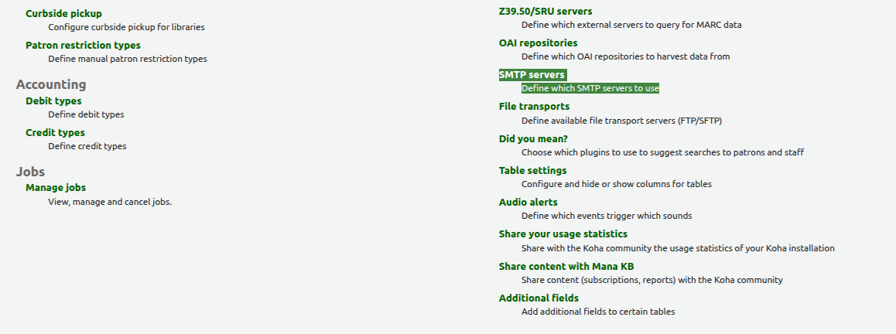
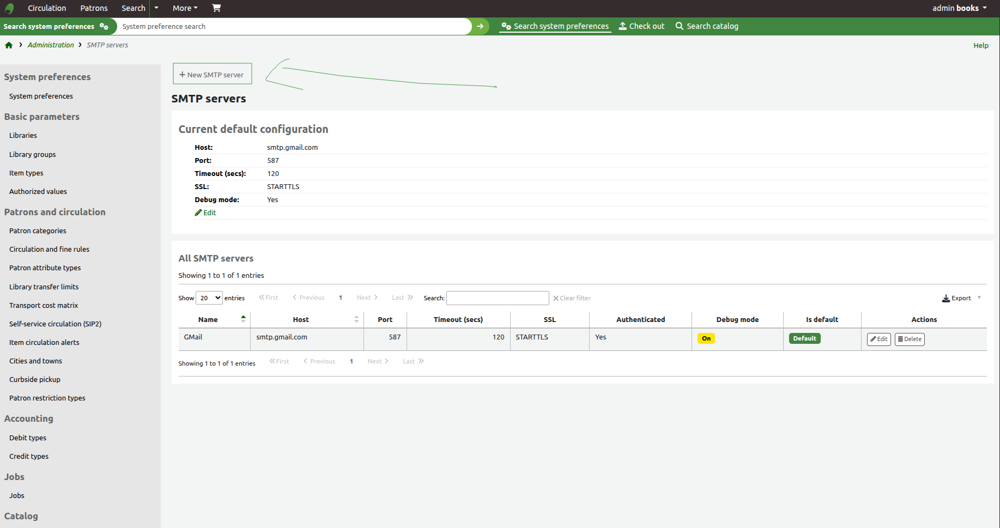
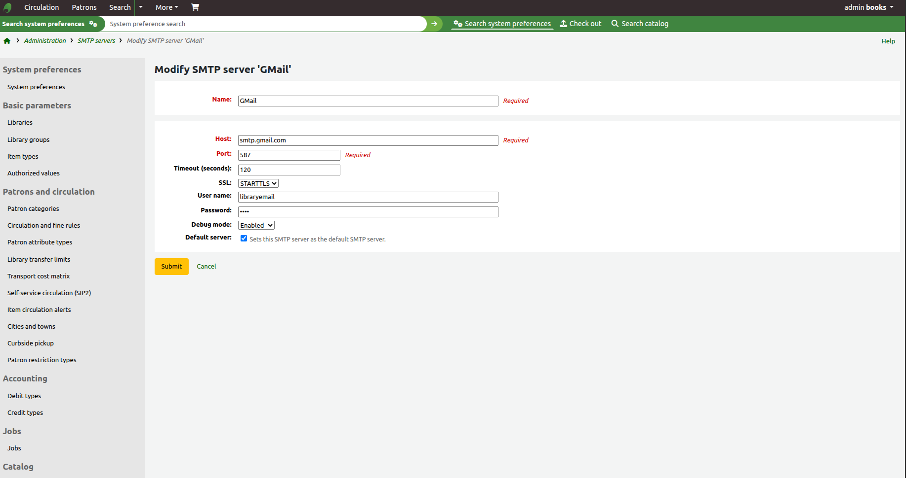
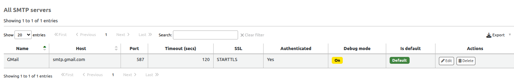
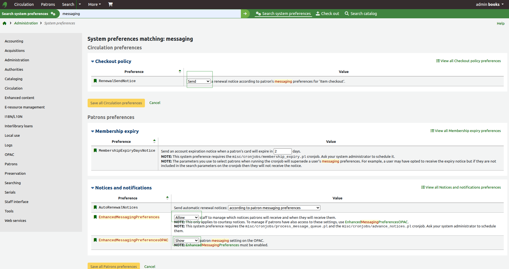
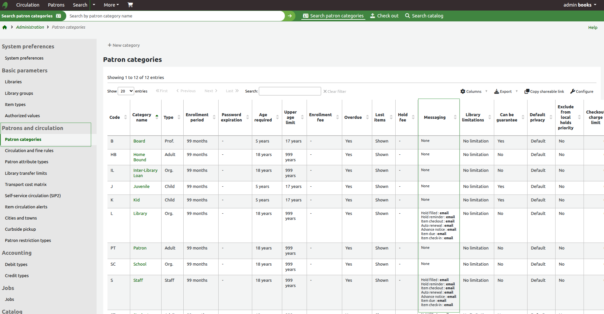

# **Configuring Email in Koha LMS: SMTP Setup, Cron Jobs & Production-Ready Delivery**

## **Overview**

This document provides a **clear, step-by-step, production-oriented guide** to configure **email delivery in Koha Integrated Library System (LMS)** using the **built-in SMTP module and Linux server tools**. It follows best practices used in real-world library deployments and covers enabling instance-level email, automating message queue processing with cron jobs, and validating reliable delivery of patron notices and system notifications.

---

## 1. Requirements

Before starting the email configuration in Koha, make sure you have the following:

* ### Library Email Account

   * An active email address that Koha will use to send notices and system messages.

   *  For this guide, Gmail is used as an example, but you can use any email provider that supports SMTP (such as Outlook, Yahoo, or a custom domain email).


* ### Supported Koha Version**

   * Koha **20.11 or later** is recommended.
   *  If you are running an older version, upgrade to ensure compatibility with modern email security and SMTP features.

---

## 2.  Gmail Security Setup (Two-Step Verification & App Password)


Google no longer allows basic “less secure app” logins. Instead, Koha must authenticate using an App Password.

### What You Need to Do

   1. Enable Two-Step Verification (2SV) on your Google account
 *  This adds an extra layer of security by requiring a second verification step when you sign in.

 2. Create an App Password for Koha
 * This generates a special password that Koha will use instead of your normal Gmail password.

This App Password will be entered into Koha’s SMTP settings later in this guide.

---

## 3. SMTP Setup (Koha Web Interface)

This section explains how to configure the SMTP server using Koha’s built-in administration panel.

### Navigation

1. Log in to Koha as an administrator.
2. Go to:
   **Home → Administration → Additional parameters → SMTP servers**
3. Click **New SMTP Server** to create a new configuration.

Step 1: 


Step 2:


---

## 4. SMTP Server Configuration (Gmail Example)

Use the following values to configure Gmail as your SMTP provider in Koha.

### Configuration Fields

| Field        | Value             | Description |
|-------------|-------------------|-------------|
| **Name**     | `GMail`           | A friendly name to identify this SMTP server in Koha |
| **Host**     | `smtp.gmail.com` | Gmail’s SMTP server address |
| **Port**     | `587`             | SSL-secured SMTP port |
| **SSL**      | ` STARTTLS` | Enables encrypted authentication |
| **User name** | `libraryemail` | Your Gmail account **without `@gmail.com`** |
| **Password** | `App Password` | The App Password generated in Google Account settings |
| **Debug**    | `Enable`  | Enables SMTP debugging (optional for troubleshooting) |
| **Default Server** | `On`  | Enables this SMTP server as the default server |

---

### Important Notes

- **Username Format**  
  Enter **only the email ID**, not the full email address.  
  > Example:  
  > If your email is `libraryemail@gmail.com`, enter: `libraryemail`

- **Password**  
  This must be the **App Password**, not your normal Gmail account password.

- **Port & Security**  
  Port `587` with **STARTTLS** is the default port for Gmail.

---

### Example

```text
Name: GMail
Host: smtp.gmail.com
Port: 587
SSL: STARTTLS
User name: libraryemail
Password: xxxxxxxx (App Password)
Debug: Enable (optional for troubleshooting)
Default Server: On
```




### Result



---
## 5. System Preferences: Messaging Configuration

This section enables Koha’s internal messaging framework, which allows the system to send circulation notices, renewal alerts, and patron notifications using the SMTP server you configured earlier.

---

### Navigation

1. Log in to Koha as an administrator.
2. Go to:
   **Home → Administration → System preferences**
3. In the search box, type: `messaging`
4. Open the **Circulation preferences** and **Notices and notifications** sections.



---

## Required Settings

Ensure the following preferences are set exactly as shown.

---

### Checkout Policy

| Preference          | Value |
|---------------------|--------|
| **RenewalSendNotice** | `Send` |

**Description:**  
Sends a renewal notice according to the patron’s messaging preferences for item checkouts.

---

### Notices and Notifications

| Preference                          | Value |
|-----------------------------------|--------|
| **AutoRenewalNotices**           | `according to patron messaging preferences` |
| **EnhancedMessagingPreferences** | `Allow` |
| **EnhancedMessagingPreferencesOPAC** | `Show` |

**Descriptions:**

- **AutoRenewalNotices**  
  Sends automatic renewal notices based on each patron’s messaging preferences.

- **EnhancedMessagingPreferences**  
  Allows staff to manage which notices patrons receive and when they receive them.

- **EnhancedMessagingPreferencesOPAC**  
  Displays patron messaging settings in the OPAC interface.

---

### Save Changes

Click:
**Save all Circulation preferences**  
and  
**Save all Patrons preferences**

to apply the configuration.

---

## 6. Server-Side Email Enablement and Message Queue Processing

This section configures Koha at the operating system level to enable email delivery for the library instance and ensures that queued messages are processed automatically using a scheduled cron job.

---

### Enable Email for the Koha Instance

Run the following command on the Koha server to enable email support for your instance in my case its `library`:

```bash
sudo koha-email-enable library
```

If successful, the system will return:

```bash
Enabled email for instance library.
```

This command activates email functionality for the specified Koha instance and allows Koha to send messages using the SMTP configuration defined in the web interface.

---

### Configure the Message Queue Cron Job

Koha stores outgoing messages in an internal queue. A cron job is required to process this queue and send emails at regular intervals.

***Edit the Cron Configuration***

Open the Koha cron configuration file:

```bash
sudo nano /etc/cron.d/koha-common
```

***Update the Schedule***
By default, this job may be configured to run every 15 minutes. For faster delivery, update the schedule to run every 1 minute.

Add or modify the following line:

```bash 
*/1 * * * * root koha-foreach --chdir --enabled --email /usr/share/koha/bin/cronjobs/process_message_queue.pl
```

This configuration ensures that Koha checks the message queue every minute and immediately sends any pending emails.

---

## 7. Patron Categories: Enable Email Messaging

This section configures patron categories to allow email delivery for circulation notices, holds, and system notifications. Messaging must be enabled at the category level, and each patron record must contain a valid email address for messages to be sent successfully.

---

### Navigation

1. Log in to Koha as an administrator.  
2. Go to **Administration**.  
3. Select **Patrons and circulation**.  
4. Click **Patron categories**.

---

### Configure Messaging for a Patron Category

1. Locate the patron category you want to configure (for example: *Library*, *Staff*, *Patron*, or *Student*).  
2. Click **Edit** for the selected category.  
3. Find the **Messaging** section.  
4. Set the delivery method to **Email** for the required notice types, such as:
   - Item checkout  
   - Item due  
   - Hold filled  
   - Advance notice  
   - Hold reminder  
5. Save the changes.

This ensures that all patrons under this category are eligible to receive email notifications.



---

### Ensure Patrons Have Email Addresses

For email notifications to work, each patron record must contain a valid email address.

#### Steps

1. Go to **Patrons**.  
2. Search for and open a patron record.  
3. Click **Edit**.  
4. Enter a valid email address in the **Email** field.  
5. Save the patron record.

---

### Verification

To confirm the configuration:

1. Perform a test action, such as checking out or renewing an item for a patron in the configured category.  
2. Wait for the message queue to process (up to one minute, based on your cron job).  
3. Confirm that the email is received in the patron’s inbox.

---

### Operational Notes

- Messaging settings apply **per category**, not globally. Each relevant category must be configured individually.  
- If a patron does not have an email address, Koha will queue the message but will not be able to deliver it.  
- Patron-level messaging preferences may override category defaults, depending on your system preference settings.

---