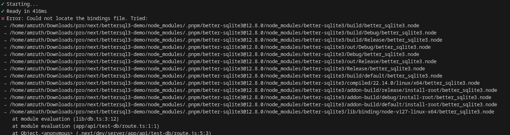

## Introduction

When you’re building a project and just need a `simple, fast database,` SQLite is usually the first thing that comes to mind. No setup, no server, no headaches.

That’s exactly where I was.

I didn’t want:

- a heavy database like MongoDB or PostgreSQL
- or the complexity of managing connections and async queries

I just wanted something that:

- works locally
- is fast
- and integrates easily with Node.js

That's when I found `better-sqlite3`.

At first, it felt perfect — clean API, blazing fast, and super easy to use.

But then I hit a problem…

👉 It worked flawlessly with `npm`
👉 And completely broke with `pnpm`

If you've ever seen this error:



> Could not locate the bindings file

…you know how frustrating it is.

In this article, I'll walk through:

- what `better-sqlite3` actually is
- why it's so good
- real-world use cases
- and the pnpm issue (with actual fixes)

## Installation

Installing `better-sqlite3` is straightforward — but this is also where things can go wrong (especially with pnpm, which we’ll cover later).

**Using npm (recommended)**
```bash
npm install better-sqlite3
```

**Using pnpm**
```bash
pnpm add better-sqlite3
```

> **Note:**
> You might run into issues with pnpm due to native bindings (we’ll fix this later in the article).

**Optional: TypeScript types**
```bash
npm install -D @types/better-sqlite3
```

## What is better-sqlite3?

`better-sqlite3` is a SQLite library for Node.js that focuses on performance and simplicity.

It is:

- synchronous (no async/await needed)
- powered by native bindings
- designed for speed and low overhead

Compared to other SQLite libraries, it feels much more direct and developer-friendly.

## Basic Usage

Here’s a simple example to get started:

```javascript
import Database from "better-sqlite3";

// Create or open a database file
const db = new Database("test.db");

// Create a table
db.prepare(`
  CREATE TABLE IF NOT EXISTS users (
    id INTEGER PRIMARY KEY,
    name TEXT
  )
`).run();

// Insert data
db.prepare("INSERT INTO users (name) VALUES (?)").run("Amruth");

// Query data
const users = db.prepare("SELECT * FROM users").all();

console.log(users);
```

## Why this feels so clean

Notice what’s missing:

- no async/await
- no callbacks
- no connection pooling

Everything runs in a simple, predictable flow, which makes it great for:

- scripts
- tools
- small apps

> **Quick Note**
> 
> Since it’s synchronous:
> - avoid using it in heavy concurrent APIs
> - but for most local or low-traffic use cases → it’s perfect

## Why better-sqlite3 is So Popular

After using better-sqlite3 for a while, it becomes pretty clear why many developers prefer it over other SQLite libraries.

It’s not just about SQLite — it’s about developer experience and performance.

Let’s break it down:

### 1. Blazing Fast Performance

One of the biggest reasons to use better-sqlite3 is speed.

- Uses native bindings (C/C++)
- Avoids async overhead
- Executes queries synchronously

**Result:**
Faster than most Node.js SQLite libraries, especially for:

- reads
- small writes
- local operations

### 2. Extremely Simple API

No callbacks. No promises. No confusion.

Compare:

**Typical async style**
```javascript
db.get("SELECT * FROM users", (err, row) => {
  if (err) throw err;
  console.log(row);
});
```

**better-sqlite3**
```javascript
const row = db.prepare("SELECT * FROM users").get();
console.log(row);
```

**Cleaner code = fewer bugs**

### 3. Reliable & Predictable

Because everything runs synchronously:

- No race conditions
- No unhandled promise issues
- Easier debugging

**What you write is exactly what runs — in order.**

### 4. Zero Configuration

No:

- database server
- connection setup
- environment variables

Just:

```javascript
const db = new Database("app.db");
```

**That’s it. Your database is ready.**

### 5. Perfect for Local-First Development

This is where better-sqlite3 really shines.

You can:

- spin up a DB instantly
- ship apps without external dependencies
- keep everything self-contained

## Real-World Use Cases

This section is very important — it shows when to actually use it:

### 1. CLI Tools & Dev Utilities

Perfect for:

- storing logs
- caching results
- saving user preferences

**Example:**
A CLI tool that stores history locally.

### 2. Desktop Apps (Electron)

SQLite is commonly used in desktop apps, and better-sqlite3 fits perfectly:

- fast local storage
- no server required
- works offline

### 3. Small Web Apps / Side Projects

For projects where you don’t need a full database server:

- admin dashboards
- internal tools
- personal projects

**Especially useful in early-stage development**

### 4. Next.js (Low to Medium Traffic Apps)

You can use it for:

- storing small datasets
- prototyping features
- replacing MongoDB in simple apps

**Example ideas:**

- invoice generator
- local analytics
- temporary data storage

### 5. Local Caching Layer

Instead of hitting an API repeatedly:

- store responses in SQLite
- read instantly

**Great for performance optimization**

### 6. Prototyping & MVPs

If you're building something quickly:

- no DB setup
- no infra
- just code and run

## But It’s Not for Everything

Avoid using it for:

- high-concurrency APIs
- large-scale production apps
- distributed systems

## Quick Summary

Use better-sqlite3 if you want:

- speed
- simplicity
- local database
## The Issue I Faced

Everything worked perfectly… until I switched to pnpm.

With npm, my setup was smooth:

- install
- import
- run

**No issues at all.**

But with pnpm, I started getting this error:

```
Error: Could not locate the bindings file. Tried:
 → .../node_modules/better-sqlite3/build/Release/better_sqlite3.node
```

And the app just crashed.

“Here’s the exact error I got:”


### What’s Actually Happening?

This isn’t a random bug — it comes down to how better-sqlite3 works internally.

### Native Bindings

better-sqlite3 uses native C/C++ bindings.

That means:

- it compiles a .node binary file
- Node.js loads that file at runtime

**This is why it’s so fast.**

### How pnpm Changes Things

Unlike npm, pnpm uses a different approach to managing dependencies:

- uses a content-addressable store
- creates symlinks instead of flat node_modules
- enforces stricter dependency resolution

**This is great for performance and disk space… but:**

Some native modules don’t play nicely with this structure.

### Why the Error Happens

In simple terms:

- better-sqlite3 expects the compiled binary in a specific path
- pnpm’s symlinked structure changes that path
- Node fails to locate the .node binding file

**Result:**

`Could not locate the bindings file`

### Why It Works with npm

npm uses a flat node_modules structure, so:

- native bindings are placed exactly where expected
- no path resolution issues
- everything just works

### When This Issue Appears

You’re more likely to see this if you:

- use pnpm
- are working with Next.js
- or install dependencies in a fresh environment

### Why This Is Frustrating

Because everything looks correct:

- package is installed
- import works
- no TypeScript errors

…but runtime fails

**This makes it confusing, especially if you’re new to native modules.**

### Key Takeaway

The issue is not with your code.

It’s a combination of:

- how better-sqlite3 handles native bindings
- and how pnpm structures dependencies

## How to Fix better-sqlite3 with pnpm

Now that we understand the problem, let’s fix it.

There’s no single “perfect” solution — but these are the ones that actually work in real projects.

### 1. Rebuild the Native Module

The first thing you should try:

```bash
pnpm rebuild better-sqlite3
```

**Why this works:**

- Recompiles the native .node bindings
- Ensures they match your system and environment

**This fixes the issue in many cases.**

### 2. Use node-linker=hoisted

If rebuild doesn’t work, this is the most reliable fix.

Create or update your `.npmrc` file:

```
node-linker=hoisted
```

Then reinstall:

```bash
pnpm install
```

**What this does:**

- Makes pnpm behave more like npm
- Creates a flatter node_modules structure
- Helps native modules resolve paths correctly

**This usually fixes binding issues completely.**

### 3. Manually Reinstall

Sometimes a clean install helps:

```bash
rm -rf node_modules pnpm-lock.yaml
pnpm install
```

Then:

```bash
pnpm rebuild better-sqlite3
```

### 4. Fallback to npm (If Needed)

If you don’t want to deal with these issues:

```bash
npm install better-sqlite3
```

**It works out of the box with npm in most cases.**

### 5. Consider Alternatives

If pnpm is critical for your workflow, you might consider:

- **sqlite3** → async but stable
- **libsql (Turso)** → modern + remote support

---

### Important Note

Even after fixing:

- native modules can still behave differently across systems
- CI/CD environments might need extra setup

**Always test in:**

- local
- production
- build pipelines

### My Recommendation

If you:

- love pnpm → use `node-linker=hoisted`
- want zero issues → use `npm`
- want modern infra → explore `libsql`

## Conclusion

`better-sqlite3` is an excellent choice if you want a fast, simple, and zero-config database for Node.js.

It really shines in:

- local apps
- small projects
- prototyping

However, if you’re using pnpm, you might run into issues due to how native bindings are handled.

The good news is — with a few tweaks like:

- rebuilding the module
- or using `node-linker=hoisted`

**you can get everything working smoothly.**

At the end of the day, the choice depends on your setup:

- want simplicity → go with `better-sqlite3`
- want zero friction with pnpm → consider alternatives

⭐ If this helped you, share it!

💬 Let me know if you faced this issue!
